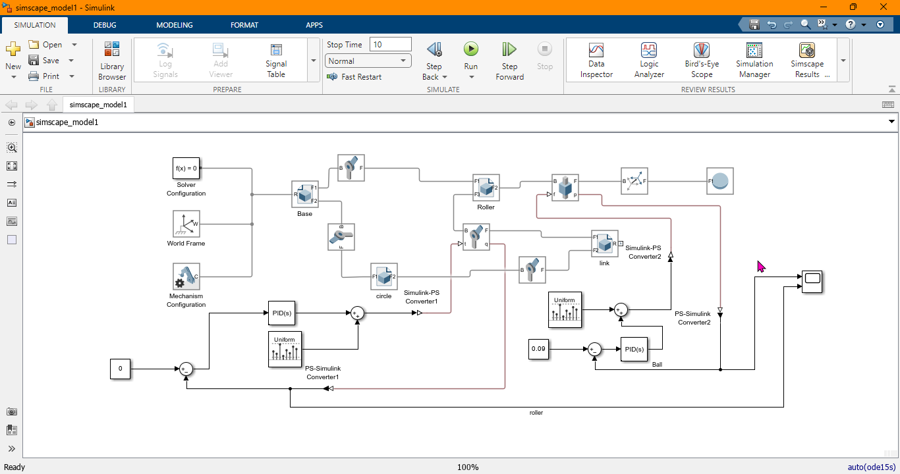
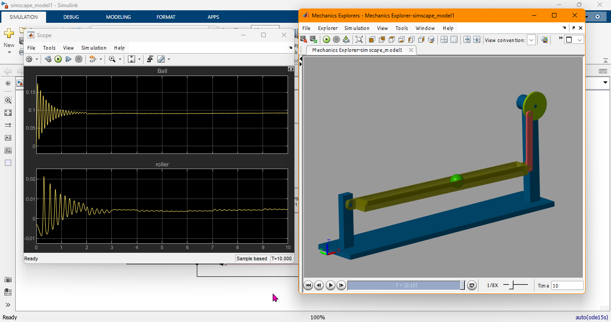

# Auto Ball Balance Simscape Model

## Overview
This repository contains a **Simscape MATLAB model** for a ball balancing system using a **PID controller**. The system aims to stabilize a ball at a specified position on a moving roller by adjusting the roller’s angle.

The **mechanical components** of the system were designed using **SolidWorks**, and the dynamic simulation was implemented in **Simulink/Simscape**.

## Features
- **PID Control**: Implements a **Proportional-Integral-Derivative (PID) controller** to stabilize the ball at a target position.
- **Physics-Based Simulation**: Uses **Simscape** for realistic dynamic modeling.
- **SolidWorks Integration**: The system’s **mechanical components** were designed in **SolidWorks** and imported into MATLAB.
- **Graphical Response**: Provides a time-domain response of the system to evaluate stability and performance.

## System Illustration
Below is a conceptual diagram of the ball balancing system:

  


## Graphical Response
The response graph below shows how the PID controller stabilizes the ball at the desired position:

  


## Requirements
- **MATLAB & Simulink (Recommended: R2022b or later)**
- **Simscape Toolbox**
- **SolidWorks (For CAD integration, optional)**

## How to Use
1. Clone this repository:
   ```bash
   git clone https://github.com/yourusername/Auto_ball_balance_simscape_model.git
   cd Auto_ball_balance_simscape_model
   ```  
2. Open MATLAB and navigate to the project folder.
3. Run the Simscape model (`balance_system.slx`).
4. Adjust the **PID parameters** if needed.
5. Observe the simulation results and tuning effects.

## Contributing
Feel free to submit issues, feature requests, or **pull requests** to improve the project!

## License
This project is licensed under the **MIT License** – see the `LICENSE` file for details.
